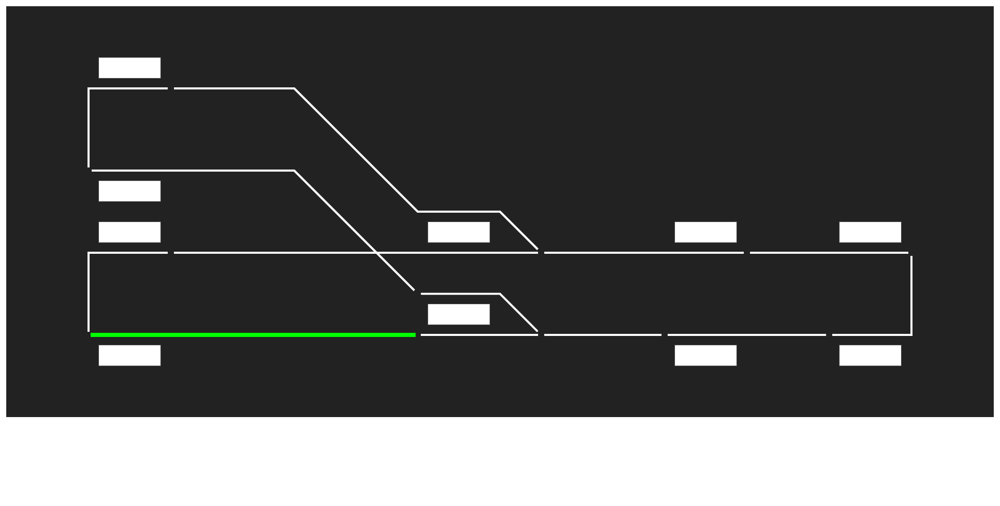

# 自動運転ビジュアライザ

自動運転プログラム (`/backend/auto_operation`) の各閉塞区間の状態をビジュアライズします。



## 必要なもの

- Node.js, npm

## セットアップ

```bash
npm install
```

## 実行

まずローカル環境で `/backend/auto_operation` を起動してください。

その後

```bash
npm run dev
```

を実行し、ブラウザで [http://localhost:3000](http://localhost:3000) を開いてください。
